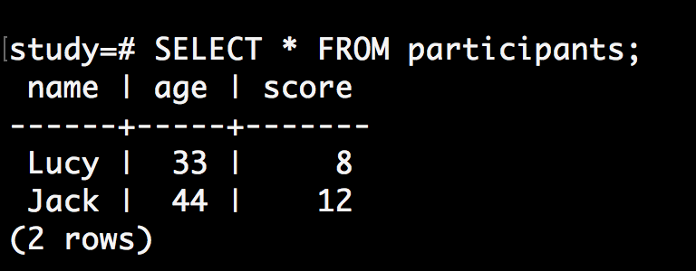

# Chapter 3: Databases and binding volumes

In this chapter, we are creating a container hosting a PostgreSQL database and binding a volume to the storage of the database to make it persistent. We will then use `docker exec` to log into the database and crate a table as well as insert some entries into the new table.

We will start again with investigating the Dockerfile. Compared to the last chapter, this Dockerfile looks quite simple:

    FROM postgres:9.6.5


We are using [this](https://hub.docker.com/_/postgres/) base image. This image comes with a fully configured PostgreSQL installation. All we have to do is provide our username, password and database name as environmental variables using:
```
ENV POSTGRES_PASSWORD safe
ENV POSTGRES_USER me
ENV POSTGRES_DB study
```

We are now all ready to build and run the container!

## Running and building the container

As we are now already experienced with building and running container images, the `build` and `run` commands should not shock as anymore:
```
docker build -t db .
docker run -d -v dbdata:/var/lib/postgresql/data --name db db
```
Most interestingly, note that PostgreSQL stores its data in `/var/lib/postgresql/data`, this is why we create and mount a volume `dbdata` to it to make our database persistent.
Our database is running in detached mode (the postgres image toggles that option by default), but we want to log in to create a table and insert some entries!

This is of course where `docker exec` comes in handy again! Using the command

    docker exec -it db psql -U me study

we are logged into our database.
The option `-it` essentially executes the command in an interactive mode where our terminal is bound to the container. We should now be logged into the database!


Execute the following SQL command to  create a table participants:

    CREATE TABLE participants (name VARCHAR(255), age INT, score INT);

Of course, the table is currently empty, as we can verify with:

     SELECT * FROM participants;


So, let us insert two entries via

    INSERT INTO participants (name, age, score) VALUES ('Lucy', 33, 8), ('Jack', 44, 12);

and check again:

     SELECT * FROM participants;

We should now see both entries!



We end our database session using

    \q

To make sure our setup is actually persistent, let us stop our container

    docker stop db

and then restart it using

    docker start db

If we reenter the database and display the content of the table participants

    docker exec -it db psql -U me study
    SELECT * FROM participants;

 we should still see both entries!

This is the end of Chapter 3, we have successfully setup a database using Docker! To finish this workshop strongly, let us combine what we have learned in Chapter 2 and Chapter 3!
